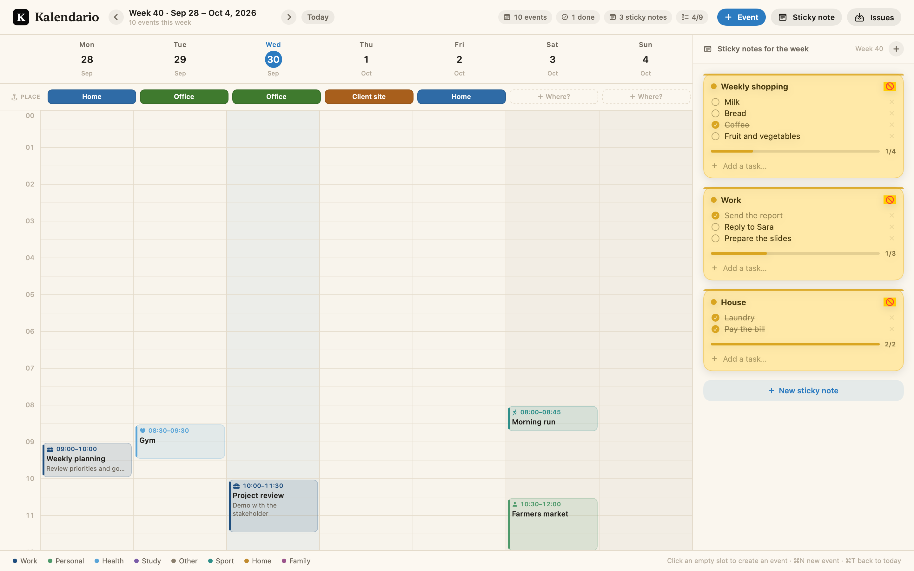

# Kalendario

A weekly planner for macOS: a week grid with events plus a sidebar of sticky notes with
to-do lists. Written in Swift and SwiftUI.



## What it does

**Weekly view (the week is the unit)**
- Seven columns, Monday → Sunday, 24 scrollable hours (opens at 07:00).
- A red line marks the current time on today's column and updates every minute.
- Events are colour-coded blocks per category, showing icon, time range, title, notes and a
  *completed* state (struck through). Overlapping events are split into lanes automatically.
- Click an empty slot to create an event at that hour; click an event to edit it.
- Navigation: ‹ › buttons, the **Today** button, or ⌘← / ⌘→ / ⌘T.

**Sticky notes with to-do lists**
- Every sticky note belongs to **one week**: switch weeks and you see that week's notes.
- Editable title in place, checkable task rows, a progress bar and a `done/total` counter.
- Six colours; actions: duplicate, move to the previous/next week, delete.

**Where you work, day by day**
- A **PLACE** row right under the day names: one customisable tag per place (Home, an office, a
  client site…) with its own colour, picked from a menu on each day. At a glance you see whether
  you work from home or which office you are in.
- Places are managed in the **Work places** sheet: add, rename, recolour or delete them.

**A normal macOS window**
- Standard title bar with the traffic lights, resizable, movable, closable; ⌘W closes it and
  the Dock icon brings it back. Full screen comes from macOS itself (green button or ⌃⌘F).

**Data** is stored in `~/Library/Application Support/Kalendario/kalendario.json`
(atomic write, debounced by 0.4 s so it does not write on every keystroke). The app starts
**empty**: nothing is pre-filled, and the sample week survives in the code for the static
previews only. If the file ever becomes unreadable, a copy is kept next to it as
`kalendario.json.bak` instead of being reset silently.

Two details worth knowing: weeks always run **Monday to Sunday** and are numbered with the
**ISO** convention, and times use the **24-hour** clock (e.g. `09:00–10:00`) regardless of the
system's 12/24-hour setting.

## Requirements

- macOS 14 or later (developed and verified on macOS 27 / Swift 6.4).
- Only the **Xcode Command Line Tools**, not Xcode: `swift build` is enough.

## Build and run

```bash
./Scripts/run.sh          # build and launch
./Scripts/build_app.sh    # create dist/Kalendario.app (with icon and ad-hoc signature)
./Scripts/install.sh      # install into /Applications (or ~/Applications) and launch
KAL_UNIVERSAL=1 ./Scripts/build_app.sh   # universal binary, arm64 + x86_64
```

Without building the bundle:

```bash
swift run -c release
```

### A note on this SDK without Xcode

In this SDK **`@State` is a macro** and its implementation plugin (`SwiftUIMacros`) ships only
with Xcode. With the Command Line Tools alone the build stops with
*"external macro implementation type 'SwiftUIMacros.StateMacro' could not be found"*.
That is why the UI state here lives in `@Observable` classes (`AppState`, `DataStore`) — the
Observation macros *are* part of the Command Line Tools. Everything else (`@Binding`,
`@Bindable`, `@Environment`, `@FocusState`) is compiled normally. Installing Xcode lifts the
restriction and `@State` becomes available again.

## Keyboard shortcuts

| Command | Shortcut |
|---|---|
| New event | ⌘N |
| New sticky note | ⇧⌘N |
| Back to the current week | ⌘T |
| Previous / next week | ⌘← / ⌘→ |
| Save the event sheet | ⏎ |

Eight categories colour the events and the legend: Work, Personal, Health, Study, Sport, Home,
Family and Other.

## Where you work, day by day

Under the day names there is a **PLACE** row. Each day shows the place you work from as a small
coloured tag:

- click a day to pick one of your places, create a new one (*New place…*) or clear the day
  (*Clear this day*);
- empty days show a dashed `+ Where?` placeholder;
- **Manage places…** (or the sheet's own list) lets you rename a place, give it one of the six
  tag colours, delete it, or add more.

Places are stored per day in your data file, so they survive restarts, and they are independent
from events: they are a one-line answer to “home or which office?” for every day of the week.

## Importing GitHub issues

Press **Issues** in the toolbar to open the import sheet:

1. Type a repository (`owner/name`, or paste its GitHub URL) and press **Load issues**.
2. Narrow it down if you want: *Include closed*, a label filter (`bug, ui`), and the maximum number of issues.
3. Tick the issues to bring over, then choose where they go: a day of the shown week, the start time,
   the spacing between them, how long each one lasts and which category to use.
4. Press **Place N on the calendar**.

Each issue becomes a normal event titled `#123 Issue title`, with the repository labels, the
assignees and a link in its notes, in the category you picked. Two rules keep the week tidy:

- an issue whose **milestone** has a due date lands on that date;
- the others stack on the chosen day, one every *N* minutes, so they never overlap.

Imported events remember where they came from, so **Update imported** re-reads every repository
already on your calendar and refreshes titles, labels and state — closed issues are ticked as
completed. Importing the same issue twice never duplicates it: the existing event is refreshed.

**Token and privacy.** Public repositories work with no token at all (60 requests/hour per IP
address, which is plenty for a weekly import). For private repositories or a much higher limit,
create a personal access token that can read issues (fine-grained: *Issues: read-only*; classic:
`public_repo`, or `repo` for private ones) and store it with **Save**: it goes into the **macOS
Keychain** and never into `kalendario.json`, the preferences or the log. **Remove** deletes it.
A `GITHUB_TOKEN` environment variable is used as a developer shortcut when no Keychain token
exists. The import is read-only: Kalendario never writes to GitHub, and nothing is sent anywhere
except to `api.github.com`.

Note: checking whether a token exists reads only the item's attributes, so macOS never asks for
the keychain password at launch; a prompt can appear when the token is actually read (*Load
issues*), because the app is signed ad-hoc and re-signed at every local build. Before committing,
`./Scripts/check_secrets.sh` scans the files a commit would include for GitHub tokens and private
keys; to make it automatic:
`ln -sf ../../Scripts/check_secrets.sh .git/hooks/pre-commit`.

## The app icon

A white Times "K" (Times New Roman Bold) on a black rounded square. It is drawn in code, so
there is no binary asset to maintain: `AppIconRenderer` renders the ten PNG sizes of an
`.iconset`, and `Scripts/build_app.sh` turns them into `AppIcon.icns` with `iconutil`.

The interface accents are blue, from azure to deep blue (`Theme.accent` `#2C7BC0`,
`Theme.accentStrong` `#1F4E7E`, `Theme.azure` `#5AA5D8`), on the same paper background as before.

## Why there is no desktop widget

macOS widgets (WidgetKit) have fixed sizes — the largest is about a quarter of the screen — and
cannot host editable text fields, so they cannot show a full week grid or clickable to-do lists.
That is why Kalendario is a regular window. Adding a WidgetKit widget (for example a read-only
week summary) is possible, but it needs an app extension, which requires Xcode to build, sign
and verify.

## Verification and diagnostics

The binary has a few service modes, handy to check a change without opening the app:

```bash
# graphical preview (2x PNG) of the whole view, without touching saved data
.build/release/Kalendario --render-preview /tmp/preview.png --size 1440x900
.build/release/Kalendario --render-preview /tmp/preview-dark.png --dark

# only the top bar, at a width of your choice
.build/release/Kalendario --render-header /tmp/header.png --size 1020x110

# generate the icon (an iconset ready for iconutil)
.build/release/Kalendario --render-icon /tmp/AppIcon.iconset

# only the "Import GitHub issues" sheet, with sample data
.build/release/Kalendario --render-import /tmp/import.png --size 640x1150

# only the "Work places" sheet, with sample data
.build/release/Kalendario --render-places /tmp/places.png --size 480x620

# talk to the real GitHub API and print what was parsed (pull requests must be filtered out)
.build/release/Kalendario --github-check swiftlang/swift

# check the files a commit would include for tokens and private keys (exits 1 if it finds one)
./Scripts/check_secrets.sh
```

## Project structure

```
Package.swift
Sources/Kalendario/
  App/           EntryPoint, AppState (UI state), IssueImportModel, WindowManager, LaunchOptions
  Models/        CalendarEvent, IssueRef, WorkLocation, StickyNote, TodoItem, EventCategory,
                 NoteColor
  Store/         DataStore (JSON persistence + sample week), GitHubClient, TokenStore (Keychain)
  Views/         RootView, HeaderBar, WeekGridView, DayColumnView, NotesRailView, EventEditorView,
                 IssueImportView, WorkLocationRow, WorkLocationsView
  Support/       WeekMath/DateText (dates, ISO weeks, en_US formatting), Theme, ColorHex, PreviewMode
  Preview/       PreviewRenderer (PNG previews), AppIconRenderer (the .icns source)
Scripts/         build_app.sh, run.sh, install.sh, check_secrets.sh
docs/            preview.png, preview-dark.png
```

Note on the data file: category and colour values are serialised with their historical Italian
raw values (`"lavoro"`, `"giallo"`, …) even though the code and UI are in English. Keeping them
means existing `kalendario.json` files keep loading unchanged; do not rename them by hand.

## Known limits and next steps

- Events cannot be dragged to another time yet: they are moved from the detail sheet.
- No recurring events, no notifications, no EventKit (macOS Calendar) integration.
- The GitHub import is read-only and one-way: moving an imported event does not reschedule the issue,
  and there is no way to create or comment on issues from the app.
- No undo for deleting events and sticky notes.
- One main window: closing it keeps the app running, reopen it from the Dock.
- Sticky notes cannot be reordered yet (they are listed in creation order).

## License

Apache 2.0 — see [LICENSE](LICENSE).